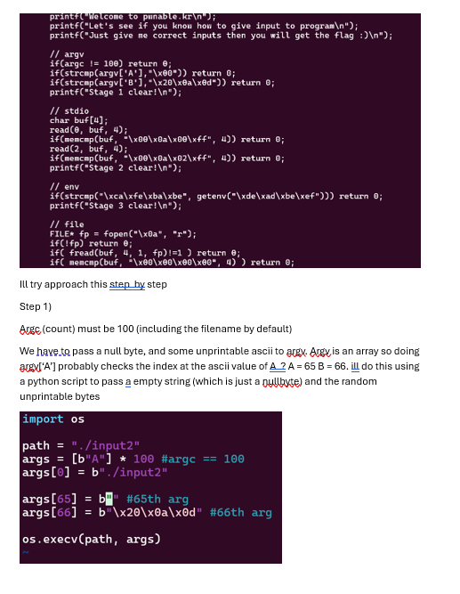
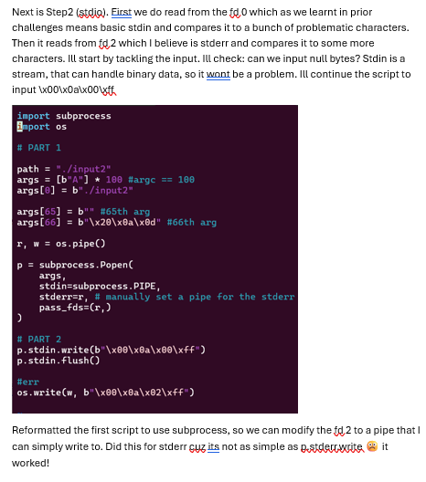
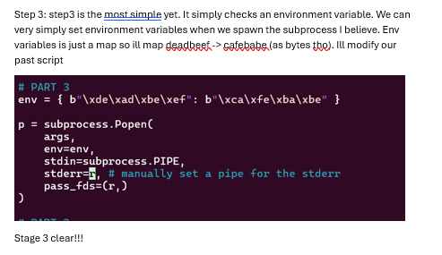
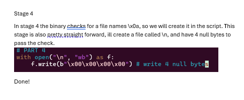
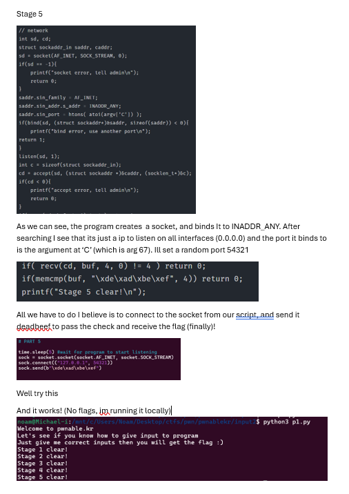

## Final Payload

```plantuml
import subprocess
import os
import socket 
import time

# PART 1

path = "./input2"
args = [b"A"] * 100 #argc == 100
args[0] = b"./input2"

args[65] = b"" #65th arg
args[66] = b"\x20\x0a\x0d" #66th arg
args[67] = "54321"

r, w = os.pipe()

# PART 3
env = { b"\xde\xad\xbe\xef": b"\xca\xfe\xba\xbe" }

p = subprocess.Popen(
    args,
    env=env,
    stdin=subprocess.PIPE,
    stderr=r, # manually set a pipe for the stderr
    pass_fds=(r,)
)

# PART 4
with open("\n", "wb") as f:
    f.write(b"\x00\x00\x00\x00") # write 4 null bytes

# PART 2
p.stdin.write(b"\x00\x0a\x00\xff")
p.stdin.flush()

#err
os.write(w, b"\x00\x0a\x02\xff")


# PART 5

time.sleep(5) #wait for program to start listening
sock = socket.socket(socket.AF_INET, socket.SOCK_STREAM)
sock.connect(("127.0.0.1", 54321))
sock.send(b"\xde\xad\xbe\xef")


```

## Though Process










