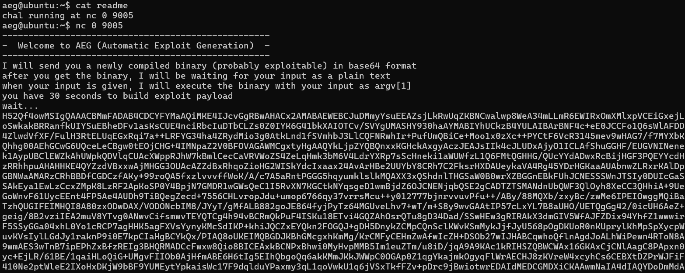
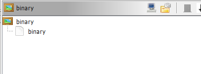
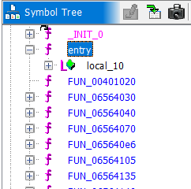
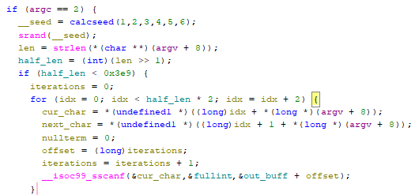
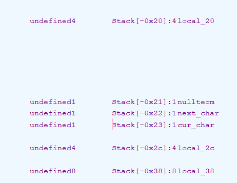

# Thought process and solution

i see we arent given any binary or source file
ill nc according to the readme



ok so thats really weird i have no idea how to approach this. ill js start by decoding the binary and checking securities per usual.w

ill have to read about AEG if thats a real topic outside of this challenge.



importing it into ghidra i see its a file system ? really weird, ill check out the dissassembly now


function names are stripped so ill go to entry and find the main function

i took a while to trasnlate each part of this main, it looks really weird but no way it was dynamically generated i think



first it calculates a random seed (i didnt go into the function since the seed is litterally never used), then it takes the len of our arg and halfs it. it checks if half our len is smaller than 1001 decimal (meaning the real max is 2001. then it loops over every 2 bytes in the payload. it takes 2 bytes and a null byte ( i guess to make a string but i didnt translat teh next part yet) and for each 2 bytes it reads it also reads 10 bytes into the variable of the first byte

to summarize the last line, it reads 10 bytes starting from cur_char. meaning it reads a couple extra bytes. but then it offsets by 1 byte and does the same. so example iteration one it does: 1, 2, nullbyte, randomshit. then iteration two: 1, 1, 2, nullbyte, randomshit. this is assuming the 3 variables are layed out on the stck one after another ill check using ghidras offsets



they are adjacent but im not sure if it reads up or down, so ill check. yeah so it reads upward. so it overwrites local_20 whcih is 4 bytes.

**i made a super dumb mistake**. it doesnt read a %20x it reads %02x. which is a byte so it makes much more sense. it writes the 1 byte (Cur_char) and offsets one. It takes your input string 2 chars at a time. Each pair of chars is a hex number like "41". sscanf parses that as 0x41 and writes it as a single byte into the buffer. So your input is a hex encoded payload and this loop is just decoding it into raw bytes.
its some weird conversions that mess with my brain so ill lay it out

example situation:

```
argv[1] = "48656c6c6f"

i 0: '4','8' > 0x48 > buf[0]  H
i 1: '6','5' > 0x65 > buf[1]  E
i 2: '6','c' > 0x6c > buf[2]  L
i 3: '6','c' > 0x6c > buf[3]  L
i 4: '6','f' > 0x6f > buf[4]  O
```

Laying it out its not that confusing it takes each 2 chars and turns them to a byte then gets the ascii value cuz of sscanf
