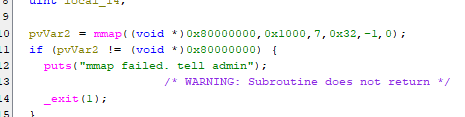
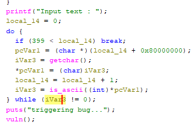
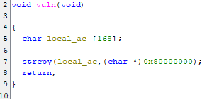

### [UNFINISHED] Solution + some thought process logging

mmap takes these params (addr, len, prot, flags, fd, offset)

prot = 7 (w r x) flags = 32 (private fixed anonymous)

we get to input 399 chars to write into the newly mapped memory. i assume were expected to insert shellcode to run in the mapped memory since the memory is executable.

vuln lets us to overflow the stack since local_ac is 168 bytes and we can write 399 into the string and wedont even have to put a null terminator. i guess with the stack overflow we could jump to an address on the mapped memory but actually no since the address would never be ascii printable. ( we can only change it by 399 to hit our code)

my current directions are like maybe jumping to libc but the description said to execute shellcode. similarly to ascii_easy maybe we can construct the address to jump to in memory or in a register. ill use the same tool i used last time to show only ropgadgets that are ascii printable. didnt have much time to work on this one right now but ill get back to it tmrw when im free
