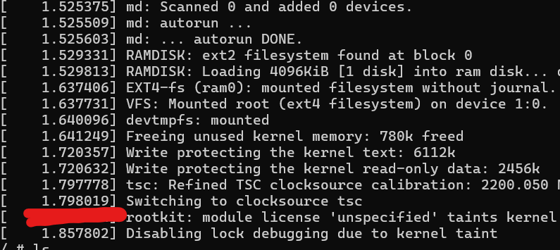
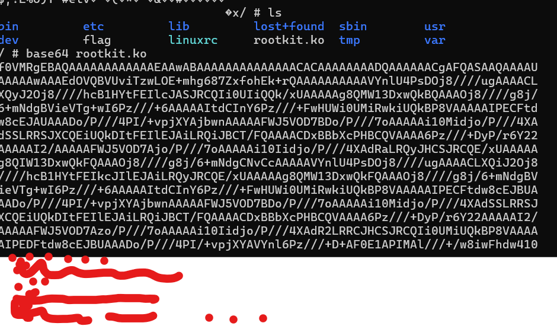
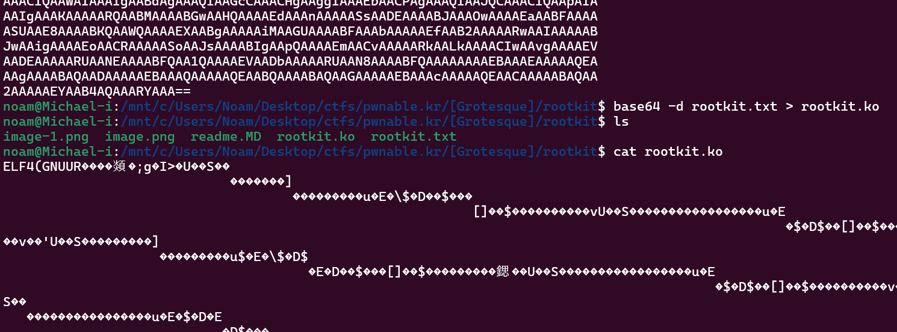
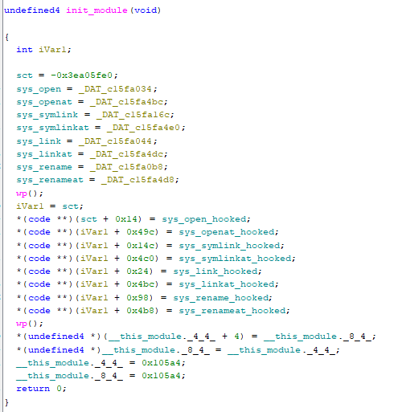
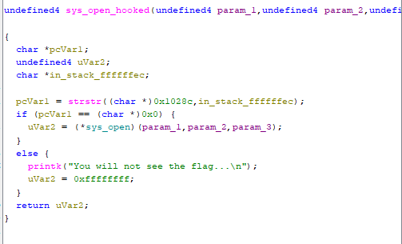
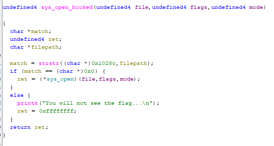
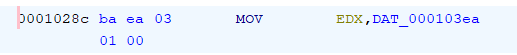
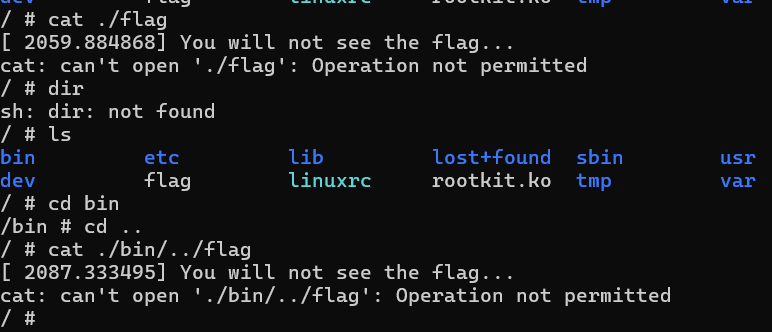
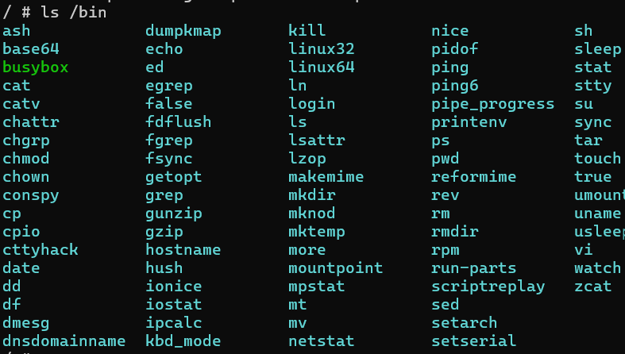
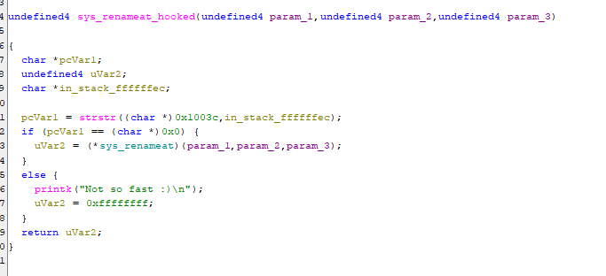

# Thought process

Seems were loading a kernal module. maybe this challenge will be similar to the syscall challenge.
ill download the .ko file and put it in ghidra

since the file is a binary and its not locally on the machine i ssh to, ill need to get it on my machine some other way. ill use base64 encoding it and then decoding it into the .ko locally.

nice now ill put it into ghidra

### init_module

Looking at init_module we can see the rootkit initializing itself.

First it saves the original syscall pointers (sys_open, sys_link, sys_rename etc), then calls wp() to disable write protection on the syscall table by clearing the WP bit in CR0, then overwrites the syscall table entries with its own hooked versions, reenables WP, and finally unlinks itself from the module list to hide from lsmod

### sys_open_hooked

this is definetly what breaks the opening of the flag file. essentially this overwrites the real open syscall and when u try to run open("flag") itll block it
ill rename variables to make this more readable

strstr finds the first occurence of the substring 'needle' in the string 'haystack' and returns a pointer to the start of the substring

format strstr(haystack, needle)

so it runs strstr checking for the string 'filepath' in the string located at `(char *) 0x1028c` and compares it to 0x0
0x0 being null that means its checking that filepath is non existent at the string located at that place.

0x1028c is a hardcoded address in the kernal module so ill check whats there

the address holds an instruction:

that means strstr is being pointed at raw machine code bytes and treating them as a string.

i actually had an aha moment and understood

the address being loaded into edx at that address holds the flag string. the reason catting flag always fails is because

so half way through the operation it runs mov edx flag and then continues the strstr which eventually compares the needle to what i assume is edx ? purely assumption

either way at the end of the day its equivelent to strstr("flag", filepath) so if i tried to open "f" itd not equal 0 becuase f is in flag. that also explains why flag would not work cuz flag is at the root directory so the full path is just "flag"
So the bypass is just opening the flag with a path that isn't a substring of "flag" like an absolute path or with path traversal

as i assumed, its not that simple.
i tried using a symlink to another file and then catting that file, but as i missed theres many other blocked / overwrited functions INCLUDING symlink

mv is hooked by rename so it wont work, ln is hooked by link.
base64 wont work cuz it uses open behind the scenes.
ill look for a vulnerability in one of the hooked functions, perhaps openat or link.

seems like renameat's hook is the only function to have a different print when it fails "not so fast :)".

after going through each function thoroughly there doesnt seem to be an obvious vulnerability in any of the hooks, they all work the same. ill try look at the bigger pictur and see what i can do on the machine itself.

## Solution

something i went back and noticed is im root, i could essentially load my own kernal module that perhaps makes the kernal see the rootkit and then js unload it, or even simpler just put back the original sys_open call in the sct

i wont provide the module's code as to not spoil the full solution and which method i used for this pwnable :)

side note, the flag file is not a simple file with the actual flag, its compressed, just b64 it, get the file on ur local machine and decompress it :)
