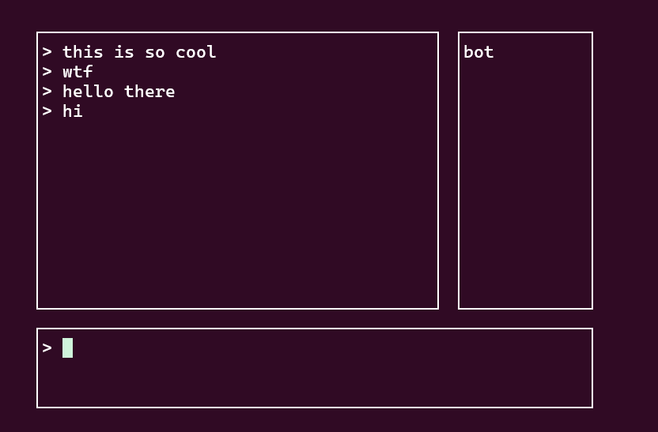
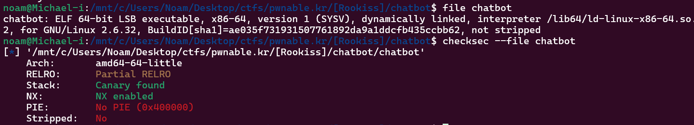
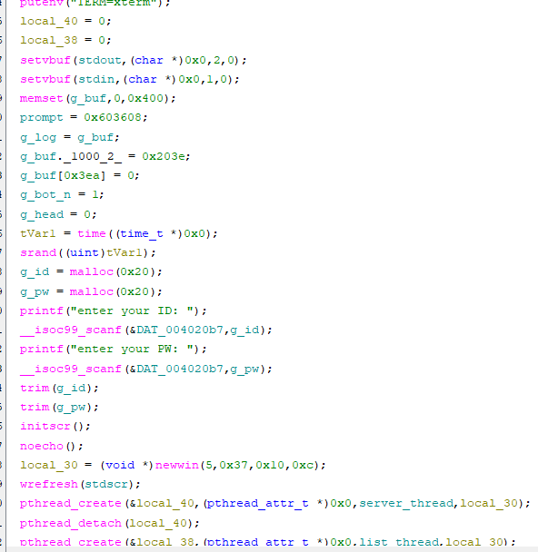
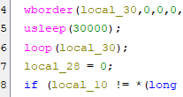
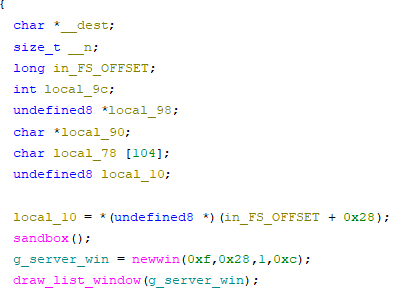
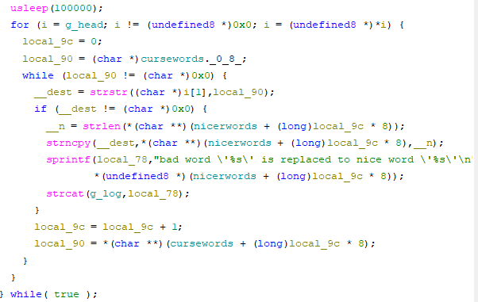
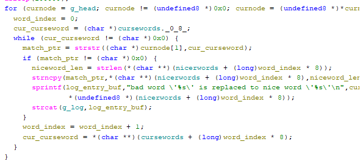

# .Solution + Thought process

Ill download the binary the libc thats used, and the dependancies ( libncurses5 ).

wow what a cool program!!! ill run file and checksec, then open it in ghidra.

first pwnable challenge thats 64 bit :-) no pie and not stripped lets check out the disassembly.

alright, skipping a lot of the ui library bloat the main function essentially intakes the user password, takes into account the null byte, and starts a server + list thread

theres tons of useless shit, for some reaosn a random seed is calculated locally but never used again lol. also a lot of functions we can ignore that initalize the UI like initscr noecho newwin etc. im interested to see what each pthread does

we also have a few more calls that couldnt fit in the screenshot. skimming loop(), it looks important, ill check it out later. now im gonna go through each thread.

## Server thread

first it seems like the thread initializes a sandbox, and the canary. next theres a server window

now the main meat and bones of the thread. seems the function iterates over some sort of linkedlist (?) checks a line for cursewords, and if it finds a curse word it strncpy the nice version of it. this could maybe cause an overflow if the curse word is shorter than the nice word? additionally it strcat's something to the fixed sized global log, maybe an overflow there too? i went ahead and renamed the variable names to make it more readable

i dont see a clear system("/bin/sh"); to jump to or anything of the sort. no cat flag or anything. what im thinking is we have to use the libc provided. but first lets actually find something to exploit lol.
