# Solution + Thought Process

descrption:

"I made a RPG game for my little brother.

But to trick him, I made it impossible to win.
I hope he doesn't get too angry with me"

```
dragon@ubuntu:~$ cat readme
once you connect to port 9004, the "dragon" binary will be executed under dragon_pwn privilege.
make connection to challenge (nc 0 9004) then get the flag
```

lets checsec and file

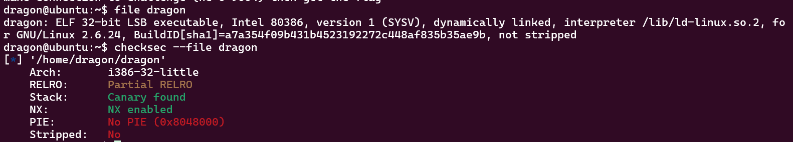

nice, ill run the binary once jsut to see how it behaves and then put it into ghidra.

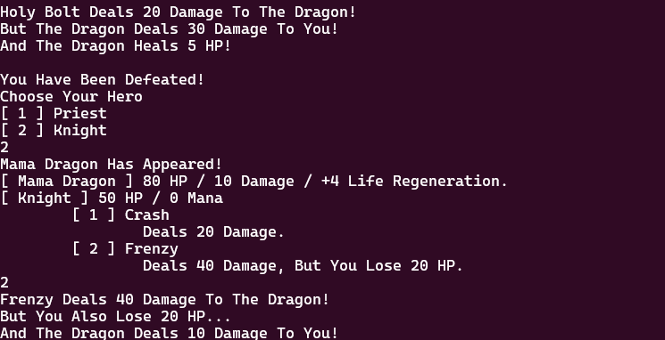

Wow its litterally an entire game. this will probably be hard to reverse and engineer and exploit. ill start by opening it in ghidra.

alright lets start from the begining. _start() initializes the program and the canary, now ill check the main function.

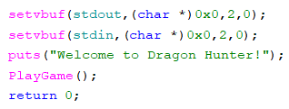

super straight forward just prints welcome and starts the game.

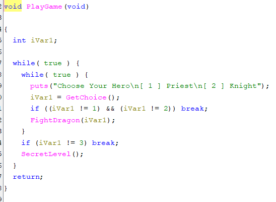

as we can see play game just checks what character we want to pick and then starts the dragon fight. if we pick 3 we get a secret level :,) lets see what get choice does, what fight dragon does and then well get to the secret level.

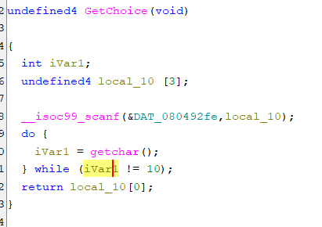

seems simple enough, reads input and cleans the buffer of \n. fight dragon is where it gets real, ill interepret it as chunks

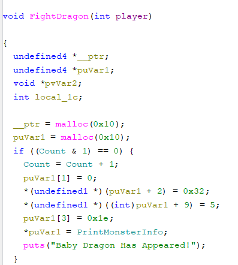

first of all i renamed the param to player as thats what we pass, we allocate some memory and do an AND operator with count (a global variable) and check if its 0 (as in counts lsb is 0 so its even) if the lsb is even it adds 1 to count, sets the some elements in the allocated memory. basically what ithink this does is switchese between the baby dragon and the mama dragon with each turn as i saw happend when i played the game. full block of code:

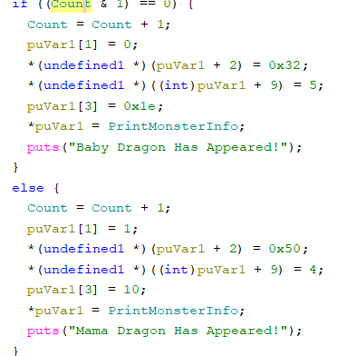

the next chunk of code i believe initalizes some player info

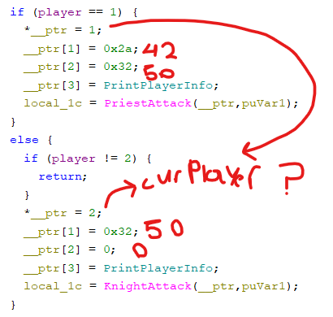

ptr[1] most likely holds the players health as the priest starts with 42 health (i noticed when i played) and the knight starts with 50. im unsure what ptr[2] is ill check on the game.

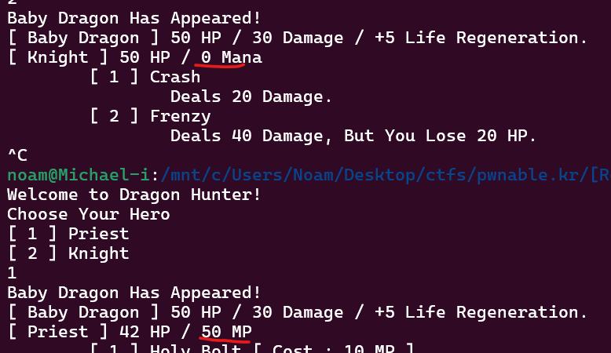

seems like ptr[2] holds mana points. ill rename ptr to player_info.

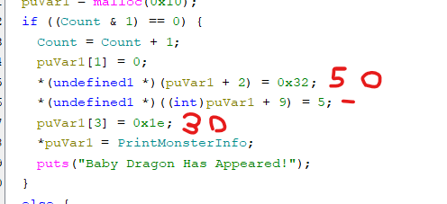

back tracking i can now pretty much understand what puVar1 holds. as ssen in the baby dragon stats it has 50 hp 30 damage and 5 life regen so ill rename it to enemy_info

ill now check the SecretLevel:

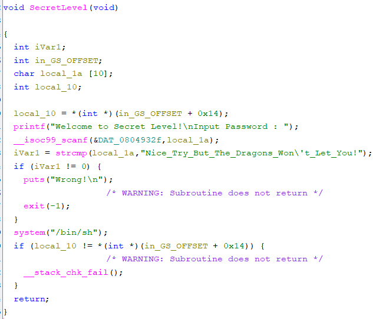

seems like it scans a string and compares it to this long string. if the strings match it gives me a shell. the issue here is that the scanf only scans 10 chars and the string it compares to is 40 chars! as we can see here: %10s

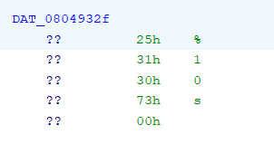

we probably have to find a way to overwrite the buffer with %40s, but the string lives on rodata (Read only) so theres virtually no way to modify it. im thinking this check is a deadend, and my actual goal might be to exploit something else to Jump to the system("/bin/sh");.

reading a bit more into FightDragon() and the different attacks it seems like qthere could be a classic use after free, which could allow me to exploit the address thats stored when printing "Info"

I think i see the use after free:

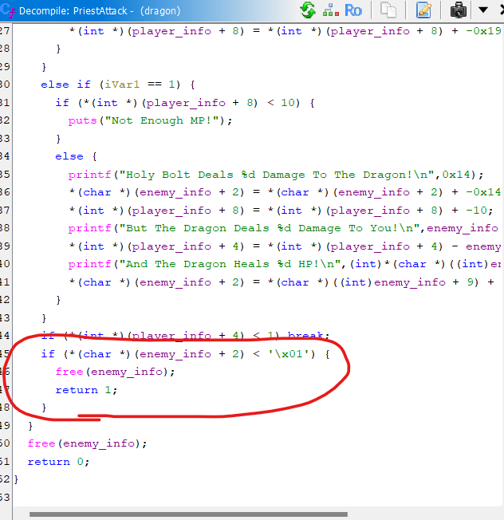

in the attack() code, it seems the enemy is free'd when its killed. but then later if the player is alive and the game has ended it tries to print the enemy's info!!! (by calling the function)S

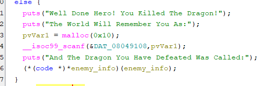

if we can possibly exploit the heap and store an address there to system() we might be able to jump to the address that pops a shell. i believe this direction is correct cuz theres a really random malloc lol :) I need to calculate how many bytes into the buffer is the pointer to the function that prints info. that way when it scans some memory i can input a address of the shell at the correct spot. also i need to find a way to win the game lol :^)

the opponent's info is freed when it ides (in the attack function) and then after its dead it allocates the same memory for user input and finally tries to call the function to print the info (Which is now overwritten by the user input)

luckily the scanf is enough memory to store the pointer (%16s)

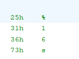

seems theres no actual possible legal way to beat the game, but i noticed that theres a pretty basic integer overflow that happens and actually makes the dragons health 0. if we lose the first time and fight the mama dragon with hp 80 and regen of 4 health each turn i can continuously use the invincible action (Twice) and then the regen mana and survive long enough for her health to turn to 0 and i win! then i just need to enter the address of the system("/bin/sh"); and we won! ill find the address when the args start getting setup for that and win! theres actually no way for me to do this without a script as i need to enter raw bytes, and its after normal input. so ill write a simple pwntools script to get invinicble and enter an address to jump to

```
from pwn import *

c = ssh('dragon', 'pwnable.kr', password='guest', port=2222)
rem = c.process('nc 0 9004'.split())

rem.send(b'1\n1\n1\n1\n3\n3\n2\n3\n3\n2\n3\n3\n2\n3\n3\n2\n') 
#pick priest, die, pick priest, go invincible, int overflow, dragon dies
rem.send(p32(0x08048dbf) + b'\n') #exploith eap overflow changethe function pointer to print dragon info
rem.interactive()   
```

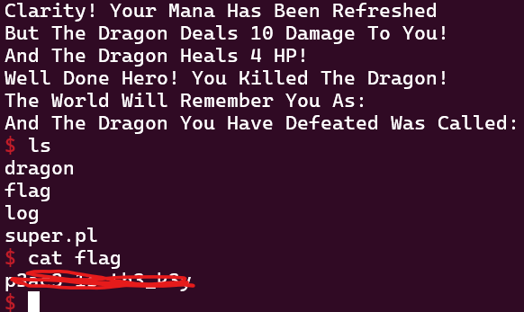

nice!

basicically as i explained earlier we win using the integer overflow and then the free and then malloc uses the same memory chunk so we can jump anywhere in memory.

&enemy_info = x

enemy_info[0] = function_to_print_info() (its just a address)

then its freed so that memory is on the free list but then we malloc that memory and input into it. when scanf is run it overwrites stuff on enemy_infos memory:

now enemy_info[0] = whatever i just inputted. if i input a different address itll jump to that address instead when calling (void (*)(void) )enemy_info[0] (). if i input raw bytes (using pwntools) itll replace the address of the function towhatever address i enter and itll jump to that
