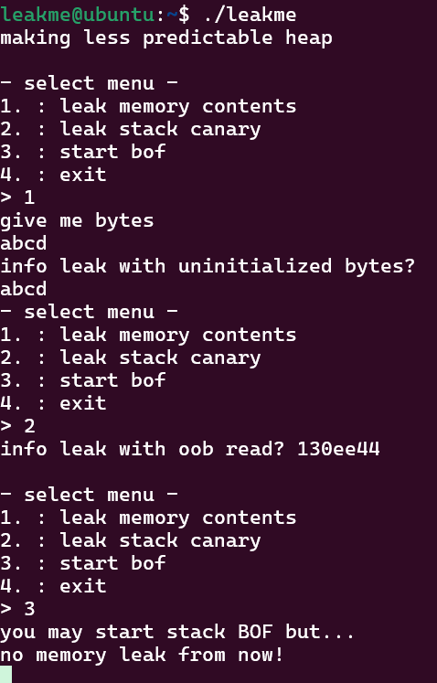
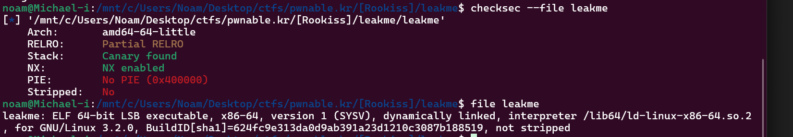
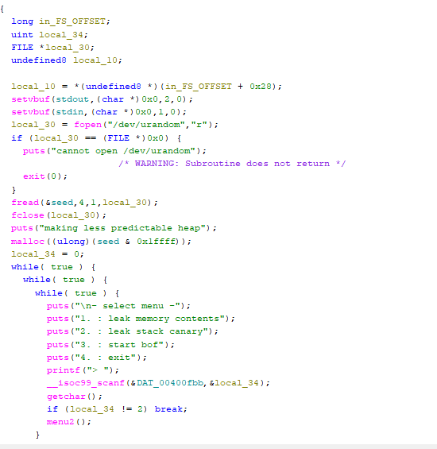
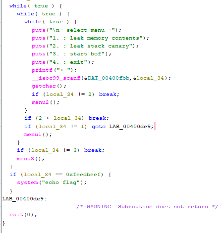
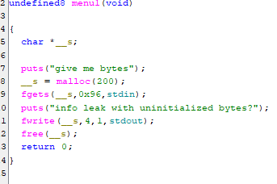
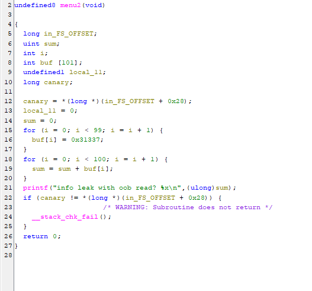
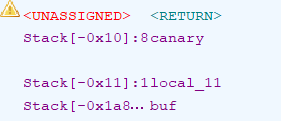
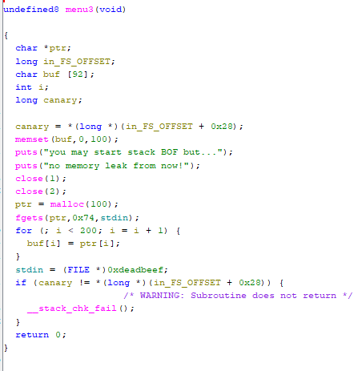

# Thought Process (UNFINISHED)

pretty cool ctf, i wonder what happens when i select start bof that makes this non trivial... ill open it in ghidra

Ill go block by block in main.

as we can see a random number is generted through /dev/urandom and stored globally as a seen. then it allocated seed & 0x1ffff bytes too randomize heap placement. now the real menu logic starts

we get an input (%d) to store a number in local_34. in some weird obfuscated way, it checks if local_34 is equal to 2 and if so it runs menu2(), if not it checks if 2 is smallerthan local34 (meaning its 3 or 4) if so it breaks otherwise it does a check for 1 and then runs menu1

after that it checks menu3 and that seems to be it. there is also a check for 0xfeedbeef but thats definetly just a redhairing or maybe we can setup different arguments cuz echo flag will just print "flag" lol

menu one lets us write something in the heap with no overflow.

i renamed some variable names. essentially we havea out of bounds leak here since the buffer initializes 100 variables and only sets 98 of them.

renamed more variable names. the final menu mallocs 100 bytes lets us write 116 aand also writes 200 bytes from the heap into the stack buffer ? weird overflow. if we can find a way to leak the canary there is potential for a simple ROP chain and then jump to the call system() instruction. the overflow here should be enough to get to the ret pointer. its also important to remember this is a 64 bit program so the arguments get passed through the registers so we have to build a chain to get a pointer to /bin/sh into a register
