# Solution + Thought Process

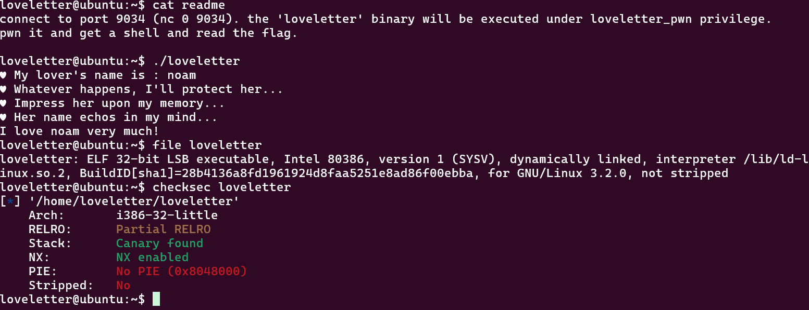

lolll this one is so cool also the icon is reall ynice ngl

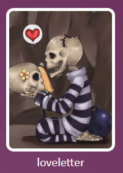

anyway ill download the binary and put it into ghidra. there seems to be quite alot of code so ill go through it block by block and try to understand it

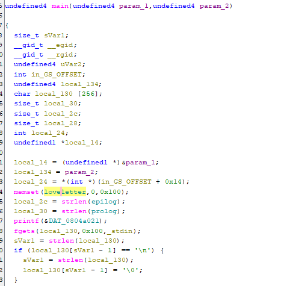

first of all we can see we got the basic main arguments (argc argv). local_14 holds the argc in some weird cast that essentially does nothing. and local_134 is holding argv. ill rename. seems local_24 holds the canary as w e can understand from the gs offset.

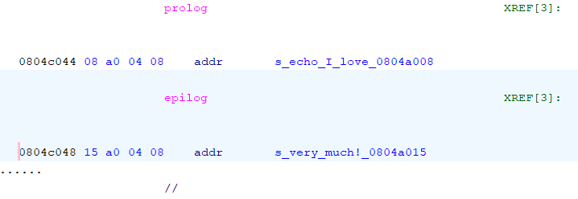

seems local 2c and 30 hold the len of each of these strings (probably to stick the input name in there). after that we print the "my lovers name is: " string and then get the input (256 bytes) and store it into local 130. we get the length of that string and store it. the function make ssure to add a null terminator  at the end.

the function prnits the ill protect my lover string and then calls some weird protect functon

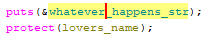

it recieves the lovers name

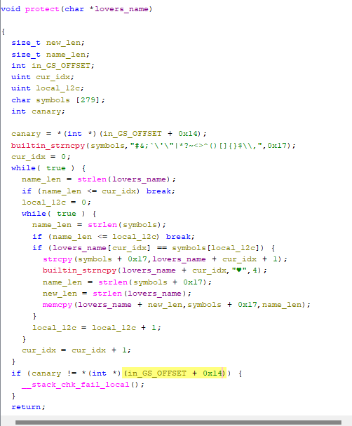

i renamed some variable names to make it easier to read

essentially for every char in loversname that appears in symbols, replace it with the heart, coppies everything after it to the end of the string.

exable name = "abcd" cymbols = "b" so itd be "a♥cdcd"

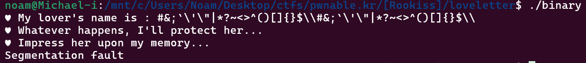

veryyyy weird :thinking:

symbols is 279 bytes. 0x17 used for the symbols, remaining 256 used for the chunks used. if the input is too big we might overflow the buffer.

`strcpy(symbols + 0x17, lovers_name + cur_idx + 1);`

unbounded write into the second part of symbols (After the blacklist)

additioanlly strlen(lovers_name) changes throughout the loop leading to repeated duplication. basically we can overflow both strings since we directly modify lovers_name. maybe thats how we can defeat the canary :-) (by writing to a local in a diffrent frame entirely)

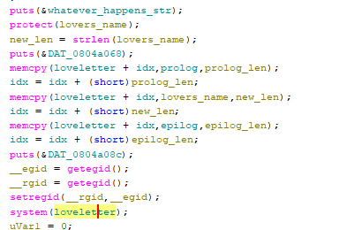

right here we call system on the global loveletter variable and we copy prolog, lovers name and epilog into there!!!! im thinking we cn overflow loversname and replace epilog to be like "/bin/sh;"  wait im dumb epilog is a global i forgot so nevermind.

this is a really weird and vulnerable way to print. the epoliog is "echo I love..... " and then we concatinate the name and the prolog to that shell command. i assume we could litterally do ; and then hav elke /bin/sh but actually symbols blocks that now that i think of it. maybe let me ujstr try do ls or something. now the symbols blacklist make s a lot more sense i was so confused. let me see if its possible to signal the end of a command with NO symbols (no ";") its sadly not all the options are blocked (pipes, $(), etc)

the utf8 heart is actualy 4 bytes which makes a lot more sense. when we have a symbol (1 byte special char) the program replaces it with a 3 byte utf8 heart plus a null byte. which means each symbol expands the string by 3 chars

i want to try overwrite the len of prolog which will let us copy 0 bytes into loveletter and therefor let us put our own commamd at the start of love letter which then later gets run. i need to get the offset needed(how much overflow)

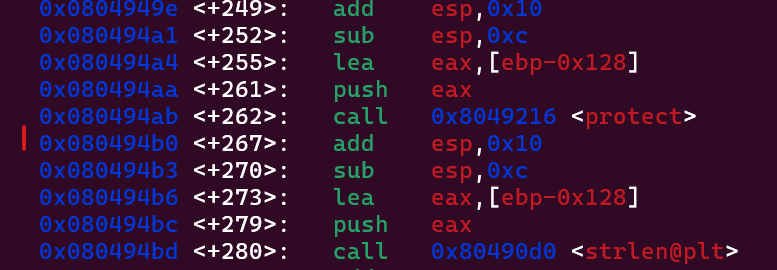

ill break right here to see what the stack looks lke after protect.

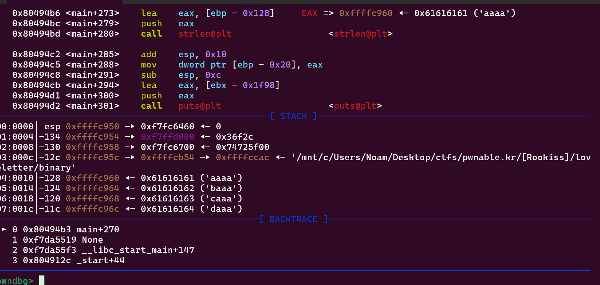

i also broke right before the strlen

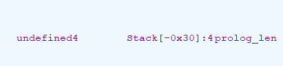

we need to overwrite this which is litteraly directly before loversname

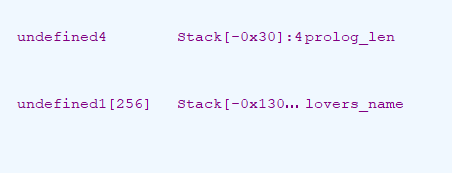

each symbol +3 bytes written past input length and we need to reach 280 bytes from buffer start.

we could just overwrite the lsb of prolog_len (since its equal to 0x0c and the c would zero it out) and zero it out by making the null byte be at byte 256 from the start of loversname. 253*"A" + "$" would would be 253 + 4 which would overwrite the lsb of prolog_len.

lets test it out

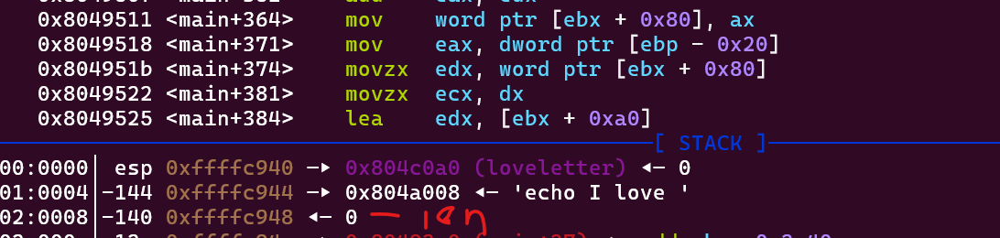

as we can see the len gets zero'd out. now we can probably just put a command at the start (i think the epilog will get ignored if we put a space at the end since itl just think its different args. ill try with ls so "ls" + " " + ((253-3) * "A") and then a symbol

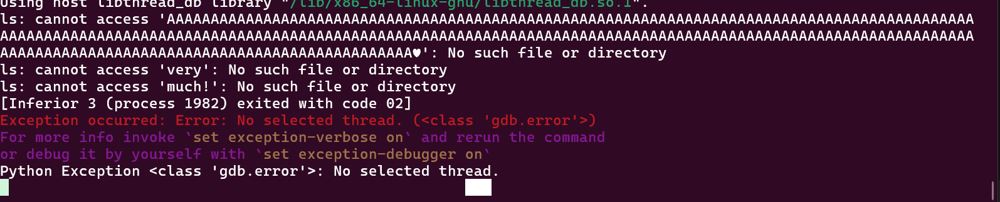

wowww looks like it worked. ill do sh now

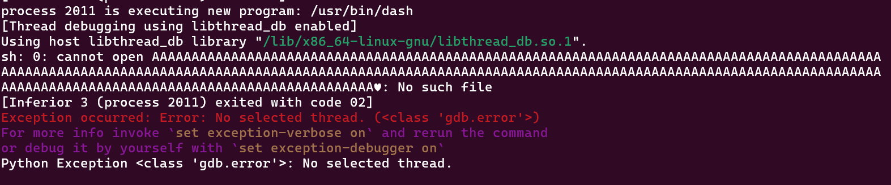

sh wont work its treating the As as a file name. we can do sh -i btu thats 6 bytes ("sh -i ") so well adjust accordingly

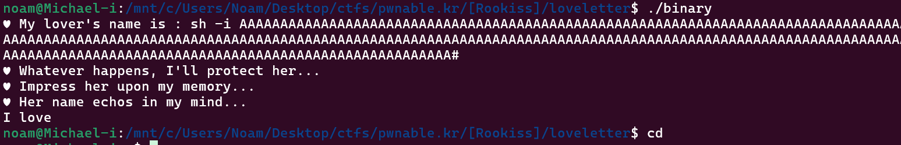

seems like it worked ill try on teh server.

doesnt seem to work. ill do like the readme told me and ill do cat flag "cat flag "

it worked!!!
