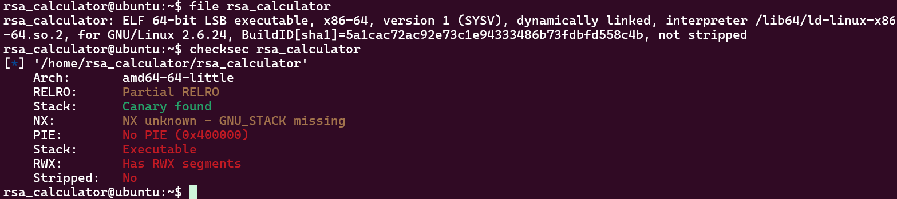
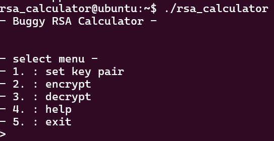
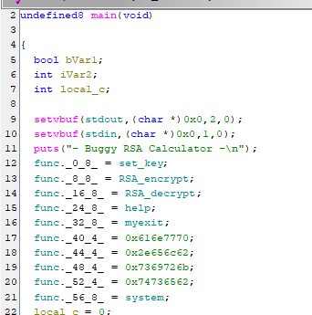
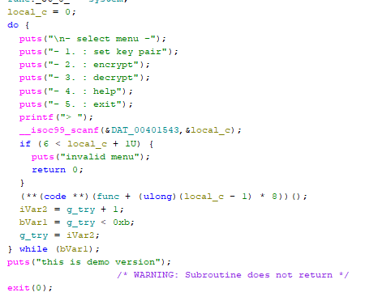
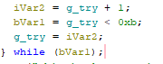
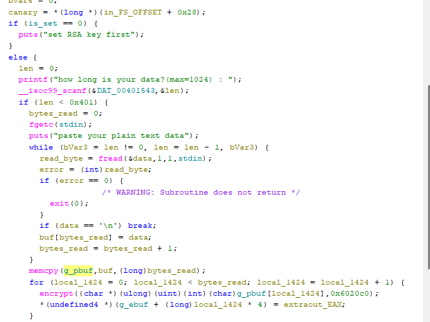
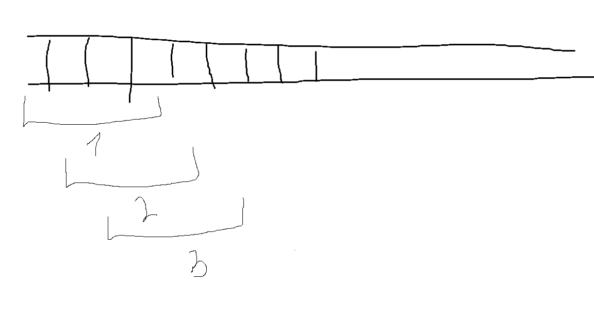
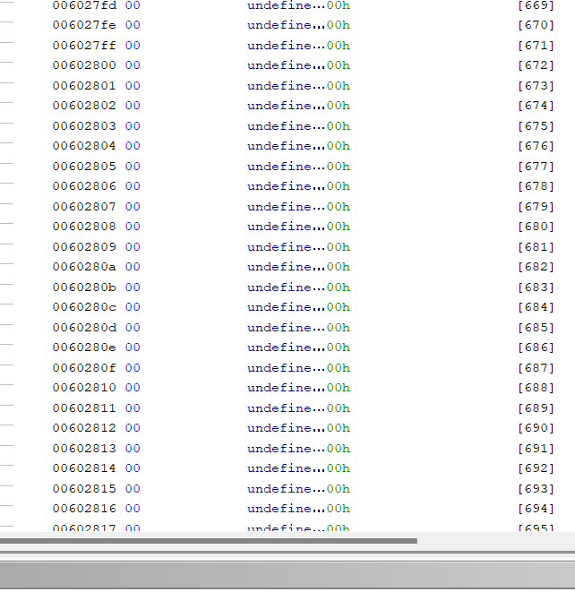

# [UNFINISHED] thought process + solution

No pie, 64 bit binary.

seems this is truley a rsa calculator that gets a key pair encrypts and decrypts. description said theres multiple vulnerabilities i have to exploit. ill take a look in ghidra.

main holds a buffer called func, which i guess holds addresses to different functions. including system. additionally we have all the RSA functions, so this is probably used in the menu something like call func[cur_selected].

next we have the menu itself. the process reads %d into local_c, checks that local_c + 1 is under 6 so essentially that local_c <  5. later we call the function at the index local_c - 1 (so selecting 1 will call func[0] which is set_key. also seems like the pointers have differnet sizes in the func list. a pointer in 64bit binary is 8 bytes, so the other 4 byte numbers are just integers. i see they spell out a string lol. so the real layout is:

functon1, function2, function3, function4, **char** **text**[**16**], function5. the text spells pwable.krisbest lol.

next it seems like it counts our tries, and caps at 11. when it hits 11 or more it prints "this is a demo version" and exits. ill go ahead and check out the different functions now.

**I wont document every step since it feels pointless.**

after reading and renaming some variables in the encrypt function ive made it to this point

essentially the user inputs up to 1024 integers (scans with %d) and stores each int into a char array of 1024. i believe theres an overflow here cuz %d scans a 4 byte integer and stores each 4 byte integer into a 1 byte index. this would essentially overflow 3 bytes at the end of the buffer:

till it overflows one 3 bytes at the last idex. oh but i see that im entirely wrong. i didnt look in depth to see that it scans into len. each byte is read with the fread not the scanf. my mistake.

seems global buffer gets to [1023] and each idx is 1 byte so its a clean 1 KB buffer.
