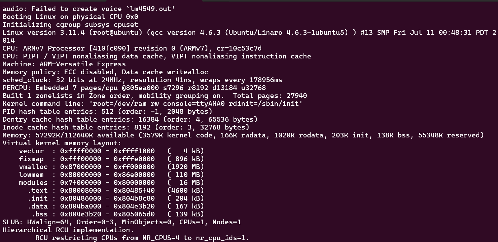
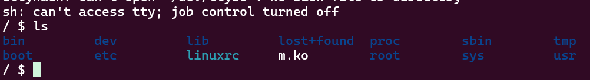
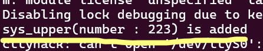
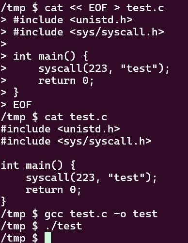
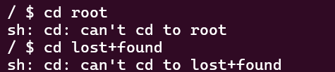

# Thought Process

The description of this CTF sounds really interesting and like something id love to try solve!!! "I made a new system call for Linux kernel."

Ill connect to the server and do the basic routine checks to get a basic picture of whats going on. well nevermind the moment i connect i get some really weird logs 

i believe this is the creation of a linux kernal. its booting a full arm linux kernal inside qemu for the challenge.



i am given a shell. i wonder what i can do with this and what the goal is.



as we can see on this line, the custom syscall is initialized with id 223. ill try make a C program that calls it just to see if it works and how it behaves.



seems to work fine. ill try print the output though i dont know what it returns. ill check more edgecases. ah, i completely missed tht the source is provided: http://pwnable.kr/bin/syscall.c

```


// adding a new system call : sys_upper

#include <linux/module.h>
#include <linux/kernel.h>
#include <linux/slab.h>
#include <linux/vmalloc.h>
#include <linux/mm.h>
#include <asm/unistd.h>
#include <asm/page.h>
#include <linux/syscalls.h>

#define SYS_CALL_TABLE		0x8000e348		// manually configure this address!!
#define NR_SYS_UNUSED		223

//Pointers to re-mapped writable pages
unsigned int** sct;

asmlinkage long sys_upper(char *in, char* out){
	int len = strlen(in);
	int i;
	for(i=0; i<len; i++){
		if(in[i]>=0x61 && in[i]<=0x7a){
			out[i] = in[i] - 0x20;
		}
		else{
			out[i] = in[i];
		}
	}
	return 0;
}

static int __init initmodule(void ){
	sct = (unsigned int**)SYS_CALL_TABLE;
	sct[NR_SYS_UNUSED] = sys_upper;
	printk("sys_upper(number : 223) is added\n");
	return 0;
}

static void __exit exitmodule(void ){
	return;
}

module_init( initmodule );
module_exit( exitmodule );
```

pretty straightforward implementation: it manually finds the sys_call_table and adds a row to it. i dont know if thats how you're supposed to implement a custom syscall so ill read some documentation. perhaps theres a vulnerability. seems like doing it this way provides no validation for arguments and is generally unsafe.

I notice that sys_upper takes 2 arguments, in and out. perhaps we can enter an empty buffer in out and trigger a crash? i realize since this runs in kernal space we can litterally give in any address for out and overwrite anything in memory :^)

im missing a direction. i see that i cant navigate to almost any folder



my current thought process is that i need to gain root somehow with this vulnerability

im going to read about how privlege is handled in linux, and what i can overwrite in memory to give myself the current process root

```
/ $ id
uid=1000 gid=1000 groups=1000
```

post reading:

essentially, the way it works is each process has a task_struct which is the kernals central structure for each process. within task struct there is the cred which is a pointer to a cred structure which holds the effective uid, gid, euid, egid, capabilities and more. in linux uid 0 is always root, so i must find the cred structure of the current shell and change the uid/euid to 0 with the arbitrary read write vulnerability we found.

important few lines that were printed on entry that may be useful for finding addresses to overwrite

```
Memory: 57292K/112640K available (3579K kernel code, 166K rwdata, 1020K rodata, 203K init, 138K bss, 55348K reserved)
Virtual kernel memory layout:
    vector  : 0xffff0000 - 0xffff1000   (   4 kB)
    fixmap  : 0xfff00000 - 0xfffe0000   ( 896 kB)
    vmalloc : 0x87000000 - 0xff000000   (1920 MB)
    lowmem  : 0x80000000 - 0x86e00000   ( 110 MB)
    modules : 0x7f000000 - 0x80000000   (  16 MB)
      .text : 0x80008000 - 0x80485f40   (4600 kB)
      .init : 0x80486000 - 0x804b8c80   ( 204 kB)
      .data : 0x804ba000 - 0x804e3b20   ( 167 kB)
       .bss : 0x804e3b20 - 0x805065d0   ( 139 kB)
```

since we are given the address of the syscall table, perhaps we can set the address that a certain syscall points to to a different kernal function that may result in privelage change

> that results in privilege change
>
