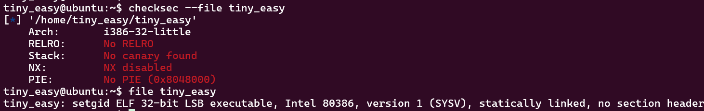
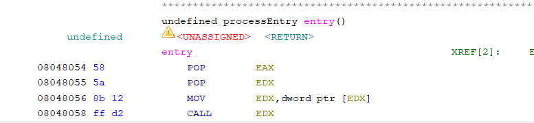
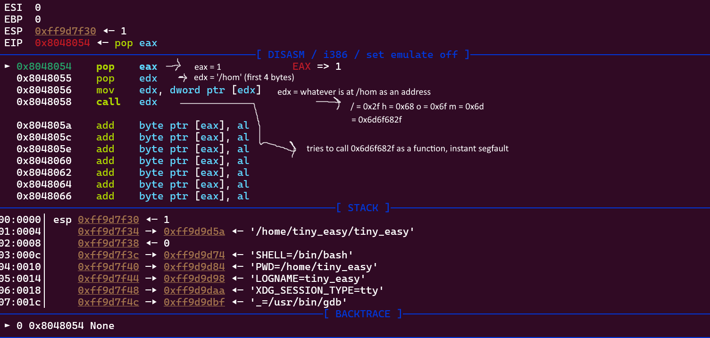

# Thought Process

```
tiny_easy@ubuntu:~$ ls
flag  tiny_easy
```

Seems we arent given the source code, nice i love the reversing challenges !!! alright lets start with checksec and file per usual.



nice no PIE no canary, stack is executable, ill run this binary just to see what it does, and then ill downlaod it locally and put it in ghidra. weird, when running hte file i get an instant segfault. lets download it.

super weird, i guess i understand the name of the ctf now



the entire binary consists of 4 instructions. im unsure whats exactly on the stack on entry so ill run this in gdb. below i made a small explanation of what happens in the program



as we can see argc gets popped into eax, argv[0] gets popped into edx (so the first 4 bytes of the absolute file path). what im thinking is we must change the file path somehow to a correct address with a function

ill check if aslr is enabled, maybe we can do something on the stack

```
tiny_easy@ubuntu:~$ cat /proc/sys/kernel/randomize_va_space
2
```

full aslr is enabled. what my thought process is currently is to change argv[0] to point to a memroy address and stick code in there that cats the flag or gives us a shell, issue is because of aslr we wont know what the address is. we need to find some sort of bypass for aslr. the common bypasses used that are relavent for our situation are leaks (for example with a format string vulnerability) which obviously we dont have, and bruteforcing (on 32bit systems)

general ranges for aslr:

stack)  0xfffdd000 < between > 0xfffff000 (grows downwards)

heap)  0x0804a000 < between > 0x09000000 (grows upwards

main binary (no pie) ) 0x08048000 < between > +-0x08050000

perhaps what we could do is pick a late number on the stack range, spam a bunch of nop bytes (0x90) (to preform a simple nop sled) and let the code keep executing till it hits our shellcode. we can pass the shellcode through another argument. later arguments are further down in the stack.

ill first write some simple shellcode to cat the flag. thankfully pwntools has shellcraft.cat() which generates the compiled assembly instructions needed to cat a file

```
tiny_easy@ubuntu:~$ cat /etc/os-release
PRETTY_NAME="Ubuntu 22.04.5 LTS"
NAME="Ubuntu"
VERSION_ID="22.04"
VERSION="22.04.5 LTS (Jammy Jellyfish)"
VERSION_CODENAME=jammy
ID=ubuntu
ID_LIKE=debian
HOME_URL="https://www.ubuntu.com/"
SUPPORT_URL="https://help.ubuntu.com/"
BUG_REPORT_URL="https://bugs.launchpad.net/ubuntu/"
PRIVACY_POLICY_URL="https://www.ubuntu.com/legal/terms-and-policies/privacy-policy"
UBUNTU_CODENAME=jammy
```

as we can see were running ubuntu so ill check if theres ubuntu specific syntax for shellcraft. generally they all use shellcraft.cat() so nothing special. cat() recieves a filename and a fd to write the contents to, well simply pick stdout.

obviously the late stack address wont always be correct since aslr randomzies the position, so ill have to run this script until it eventually hits and the instruction lands on my nop sled

ill choose a range of addresses and fork the process to duplicate it and replace the image of the child with the tiny_easy process with the new args to make an efficient bruteforce. this wont work with pwntools connecting to the server so ill have to run this manually (ill create the script in tmp on the server)

This worked!!!
