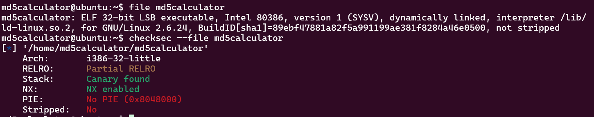
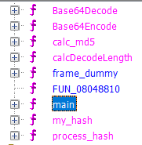
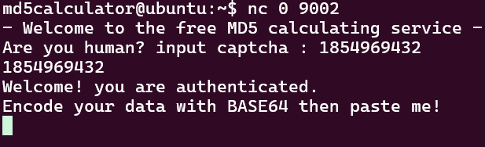

# Thought Process

Connecting to the server i see a few files (Dockerfile, super.pl) the binary, and a readme. the readme simply explains how to run the binary (netcat) and to try crack the calculator. i want to understand what this md5calculator does but we are not given the source code. ill start by running file and checksec on it



No aslr and its not stripped!!! my life has been made a lot easier. ill download this file to my computer using scp and put it into ghidra.         After letting ghidra identify functions i see a main, ill start from the begining and check what it does. we can also so a custom hash implementation, but we'll get to that later.



```
undefined4 main(void)

{
  uint __seed;
  int local_18;
  int local_14;
  
  setvbuf(stdout,(char *)0x0,1,0);
  setvbuf(stdin,(char *)0x0,1,0);
  puts("- Welcome to the free MD5 calculating service -");
  __seed = time((time_t *)0x0);
  srand(__seed);
  local_14 = my_hash();
  printf("Are you human? input captcha : %d\n",local_14);
  __isoc99_scanf(&DAT_080492df,&local_18);
  if (local_14 != local_18) {
    puts("wrong captcha!");
                    /* WARNING: Subroutine does not return */
    exit(0);
  }
  puts("Welcome! you are authenticated.");
  puts("Encode your data with BASE64 then paste me!");
  process_hash();
  puts("Thank you for using our service.");
  system("echo `date` >> log");
  return 0;
}

```

The puts calls make this a lot easier to understand, as we can see we have to identify ourselves by copying the hash thats calculated? the print casts local_14 to a int, later ill check what my_hash returns.  after authenticating i see we get to mayb run our own input through the hash function? ill go ahead and check what my_hash() does.

```
int my_hash(void)
{
  int iVar1;
  int in_GS_OFFSET;
  int local_3c;
  int local_30 [4];
  int local_20;
  int local_1c;
  int local_18;
  int local_14;
  int local_10;
  
  local_10 = *(int *)(in_GS_OFFSET + 0x14);
  for (local_3c = 0; local_3c < 8; local_3c = local_3c + 1) {
    iVar1 = rand();
    local_30[local_3c] = iVar1;
  }
  if (local_10 != *(int *)(in_GS_OFFSET + 0x14)) {
                    /* WARNING: Subroutine does not return */
    __stack_chk_fail();
  }
  return local_1c + local_30[1] + (local_30[2] - local_30[3]) + local_10 + local_14 +
         (local_20 - local_18);
}
```

my hash uses a bunch of unitialized integers to calculate a sort of pseudo random number (a predictable random, no randomized seed is used) and returns an int. i dont see a reason why inputting the string thats printed wouldnt work. ill try.



that was slighlty easier than i expected, i probably wasted some time on a red hairing. anyway ill continue on to the hash itself. ill go ahead and read process_hash() which is the next function called by main.
